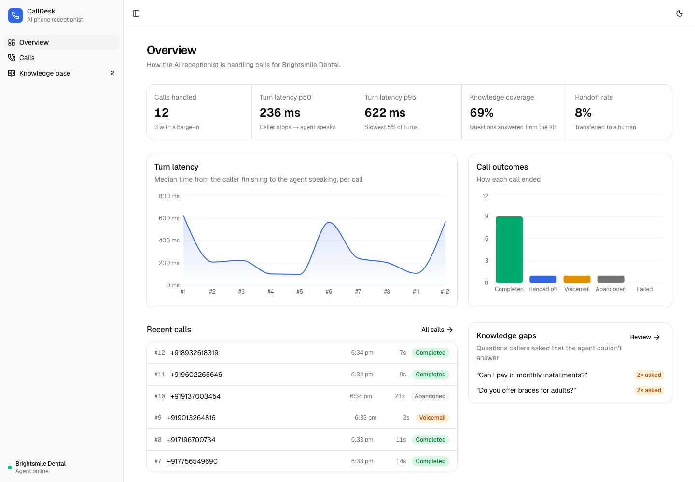
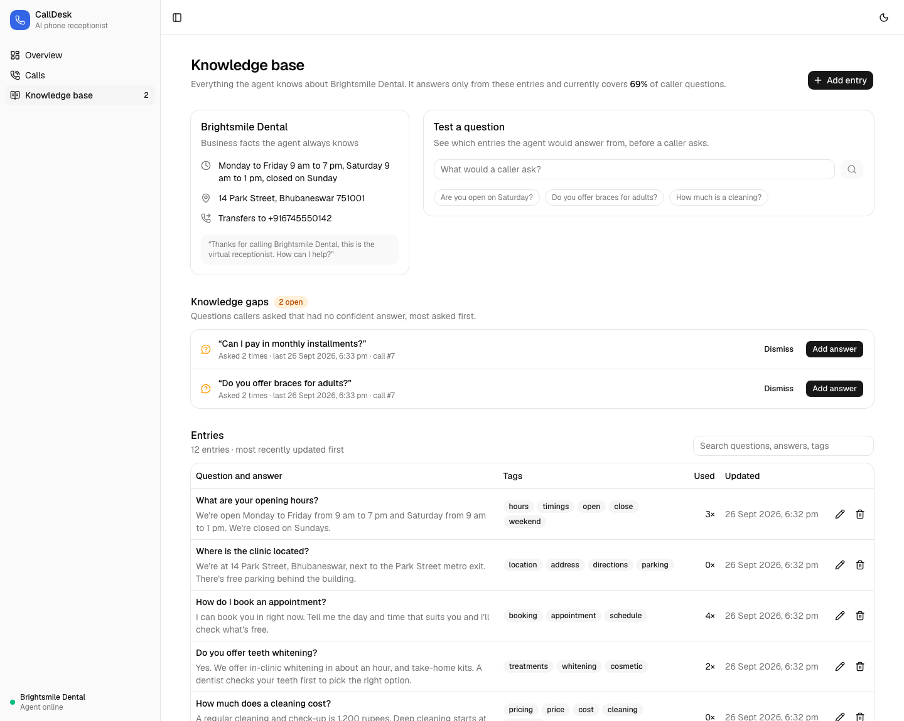
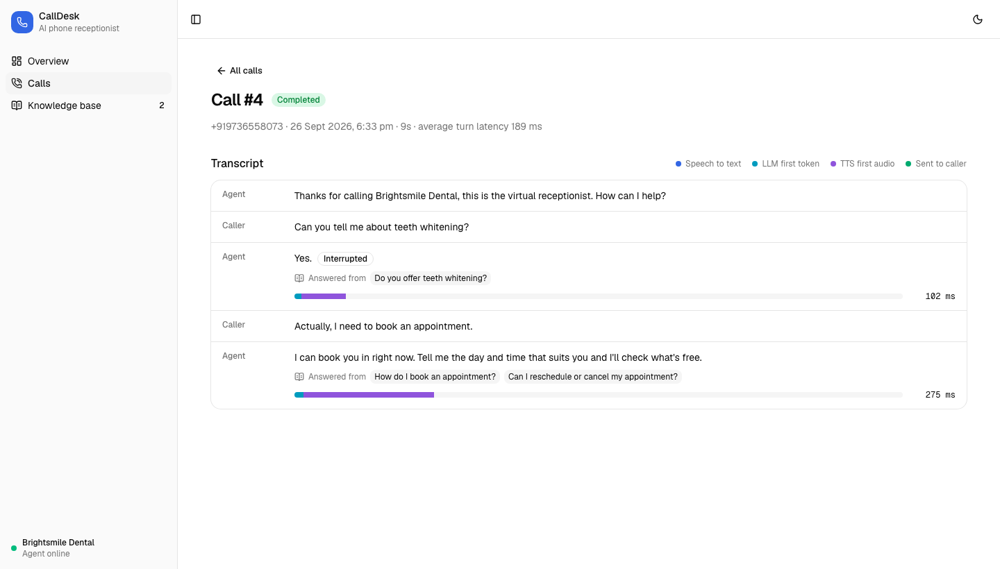
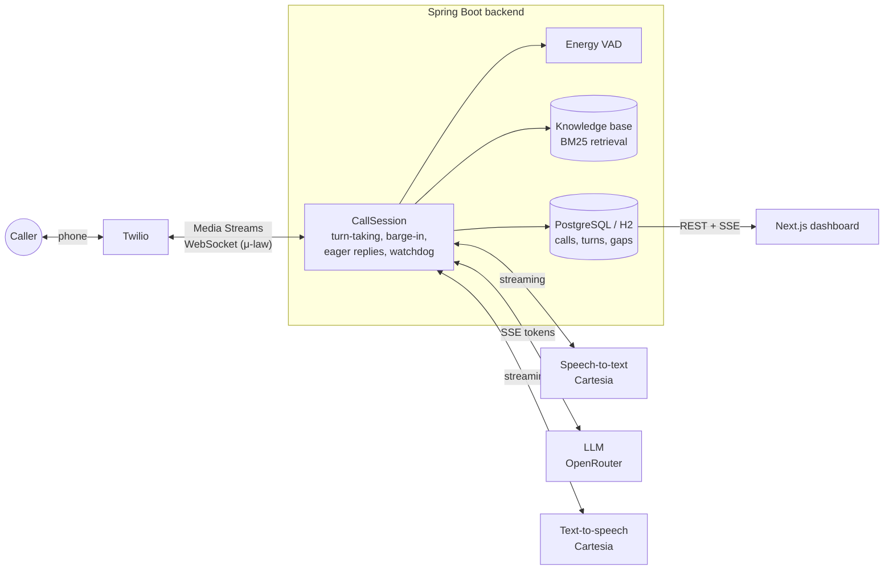

# CallDesk

**An AI phone receptionist that answers calls in real time, only says what its knowledge base supports, and tells you what it still needs to learn.**

A caller rings a Twilio number. CallDesk streams the call audio over a WebSocket, detects when the caller stops talking, transcribes, asks an LLM for a grounded answer, and streams synthesized speech back, sentence by sentence, while the LLM is still writing. Callers can interrupt it mid-sentence. Every call, turn and latency measurement lands in a dashboard, along with the knowledge base the agent answers from and the questions it couldn't answer.

**[Live demo](https://calldesk-topaz.vercel.app)** (dashboard on sample data) · [Backend docs](backend/README.md) · [Dashboard docs](dashboard/README.md)

<picture>
  <source media="(prefers-color-scheme: dark)" srcset="docs/screenshots/overview-dark.png">
  
</picture>

## Features

**Real-time voice loop**
- Twilio Media Streams over WebSocket, μ-law audio at 8 kHz in 20 ms frames
- Energy-based voice activity detection to find the end of a caller's turn
- LLM output streamed into TTS one sentence at a time, so the agent starts speaking before the answer is complete
- **Barge-in**: when the caller talks over the agent, playback is cleared instantly and the transcript records exactly what they heard
- **Eager replies**: generation starts on a stable partial transcript and is reused if the final transcript matches
- Silence reprompts, voicemail detection, and handoff to a human over a live call transfer

**Grounded answers with a managed knowledge base**
- The agent answers only from knowledge base entries retrieved with BM25; it never invents facts
- Every answer in a transcript links to the entries it came from
- **Knowledge gaps**: questions the agent had no confident answer for are logged, de-duplicated and counted, so you can answer the most-asked ones in one click
- "Test a question" shows what the agent would answer from before any caller asks

**Observability**
- Per-turn latency broken into speech-to-text → LLM first token → TTS first audio → audio sent to the caller
- p50/p95 turn latency, knowledge coverage, handoff rate and outcomes, with live updates over Server-Sent Events

| Knowledge base | Call transcript |
| --- | --- |
|  |  |

## Architecture



Every external provider sits behind an interface with a mock implementation, so the whole system (including full simulated calls) runs and is tested with **zero API keys**.

## Quick start

### Option 1: Docker (everything)

```bash
cp .env.example .env          # optional: leave as is for mock mode
docker compose up --build
```

Open http://localhost:3000. The backend runs on :8080 with PostgreSQL.

### Option 2: local development

Requirements: JDK 21 and Node.js 20+.

```bash
# Backend (mock providers, H2 database)
cd backend && ./mvnw spring-boot:run

# Dashboard
cd dashboard && cp .env.example .env.local && npm install && npm run dev
```

The dashboard is empty until calls come in. To generate realistic calls without a phone, start the backend with the `sim` profile and run a scenario:

```bash
cd backend && ./mvnw spring-boot:run -Dspring-boot.run.profiles=sim
curl -X POST localhost:8080/api/simulate -H 'Content-Type: application/json' -d '{"scenario":"interrupt-agent"}'
```

Scenarios: `book-appointment`, `ask-hours`, `interrupt-agent`, `ask-for-human`, `unknown-question`, `silent-caller`, `voicemail`. The simulator speaks the exact Twilio Media Streams protocol, so calls go through the real WebSocket handler.

## Taking real calls

1. Create accounts and fill in `.env` (see `.env.example` for where to get each key):
   - **Twilio**: a phone number, Account SID and Auth Token
   - **Cartesia**: API key and a voice ID (speech-to-text and text-to-speech)
   - **OpenRouter**: API key (any chat model it offers)
2. Set `STT_PROVIDER=cartesia`, `TTS_PROVIDER=cartesia`, `LLM_PROVIDER=openrouter`.
3. Expose the backend publicly, for example `ngrok http 8080`, and set `PUBLIC_BASE_URL` to that HTTPS URL.
4. In the Twilio console, set your number's **A call comes in** webhook to `POST {PUBLIC_BASE_URL}/twilio/voice`.
5. Call the number.

To make it your own business, point `BUSINESS_PROFILE` at a YAML file like [`demo-clinic.yaml`](backend/src/main/resources/business/demo-clinic.yaml) (name, greeting, hours, address, handoff number and starter FAQs), then manage answers from the dashboard's Knowledge base page.

## Configuration

All settings are environment variables, documented in [`.env.example`](.env.example). The ones you'll touch most:

| Variable | Purpose | Default |
| --- | --- | --- |
| `STT_PROVIDER` / `LLM_PROVIDER` / `TTS_PROVIDER` | `mock`, or `cartesia` / `openrouter` / `cartesia` | `mock` |
| `PUBLIC_BASE_URL` | Public HTTPS URL of the backend, used in the TwiML stream URL | `http://localhost:8080` |
| `TWILIO_ACCOUNT_SID`, `TWILIO_AUTH_TOKEN` | Call transfer and webhook signature validation | empty |
| `CARTESIA_API_KEY`, `CARTESIA_VOICE_ID` | Speech-to-text and text-to-speech | empty |
| `OPENROUTER_API_KEY`, `OPENROUTER_MODEL` | Chat model for answers | `openai/gpt-4o-mini` |
| `BUSINESS_PROFILE` | YAML with business facts and starter FAQs | demo dental clinic |
| `KNOWLEDGE_MIN_SCORE` | Minimum retrieval score for a confident answer | `2.2` |
| `NEXT_PUBLIC_API_URL` | Backend URL for the dashboard (in `dashboard/.env.local`) | `http://localhost:8080` |

## Tests

```bash
cd backend && ./mvnw verify
cd dashboard && npm run lint && npx tsc --noEmit
```

The backend suite covers the audio pipeline (μ-law, VAD), retrieval, the turn-taking state machine under a fake clock (barge-in, eager replies, stale-turn cancellation, hang-up mid-reply, handoff races, silence, voicemail), the knowledge base and gap tracking, the REST/SSE API, and an integration test that runs every scenario end to end through the WebSocket handler.

A note on numbers: latency shown with mock providers measures CallDesk's own pipeline overhead, not real-world call latency. Real numbers depend on your STT, LLM and TTS providers and region.

## Tech stack

**Backend:** Java 21, Spring Boot 3.5, Spring WebSocket, Spring Data JPA, PostgreSQL / H2, virtual threads, JUnit 5, Mockito
**Dashboard:** Next.js 16, React 19, TypeScript, Tailwind CSS 4, shadcn/ui on Base UI, recharts, NumberFlow, Sonner
**Voice:** Twilio Media Streams, Cartesia (STT and TTS), OpenRouter (LLM)

## Project structure

```
backend/     Spring Boot service: telephony, audio, conversation engine, knowledge base, REST + SSE API, simulator
dashboard/   Next.js dashboard: overview, calls and transcripts, knowledge base
docs/        Specs, status notes and screenshots
```

## License

[MIT](LICENSE) © 2026 Ridhi Kumari
