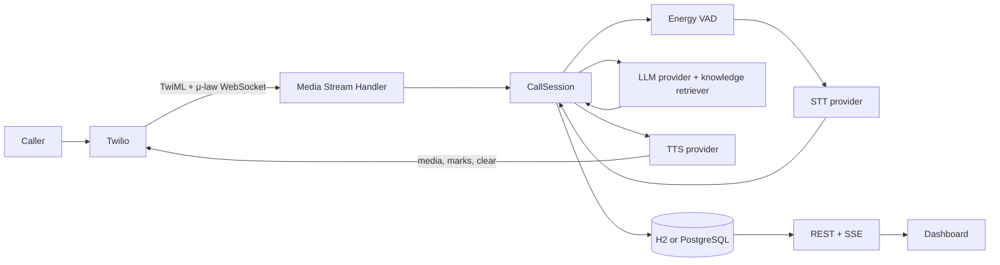

# CallDesk backend

CallDesk accepts Twilio Media Streams, runs speech-to-text, an LLM, and speech synthesis, and stores calls and turns for the dashboard. All providers default to local mocks, so a clean checkout can run without API keys.

## Architecture



Each call has a serialized state executor and a per-call virtual-thread executor. Audio uses 8 kHz G.711 μ-law frames. FAQ matching uses BM25 over a database-backed knowledge index. The mock speech provider consumes scripted utterances; the mock LLM answers from confident matches; mock TTS returns a short tone.

## Run in mock mode

Java 21 and Maven are required.

```sh
cd backend
mvn spring-boot:run
```

The backend listens on `http://localhost:8080` and stores data in the local H2 file database. Provider selection defaults to mock. Configuration is in `src/main/resources/application.yml`; environment variable names and safe defaults are listed in the repository root `.env.example`.

Run the dashboard separately at `http://localhost:3000`. The API allows that origin.

## Run simulated calls

With the mock providers enabled, submit one of the bundled scenarios:

```sh
curl -X POST http://localhost:8080/api/simulate \
  -H 'Content-Type: application/json' \
  -d '{"scenario":"ask-hours"}'
```

The response contains a `callId`. Available scenarios are `book-appointment`, `ask-hours`, `interrupt-agent`, `ask-for-human`, `silent-caller`, `voicemail`, and `unknown-question`. The simulator connects to the real `/twilio/media` handler, sends 20 ms μ-law frames, and returns mark acknowledgements after modeled playback time. `unknown-question` asks two unsupported questions and records them as open knowledge gaps.

Alternatively, start with `SPRING_PROFILES_ACTIVE=sim`; this profile forces mock STT, LLM, and TTS. Silent-caller runs for about 22 seconds so the reprompt and hangup watchdogs can run.

## Configure real providers

Copy `.env.example` to `.env` and add credentials locally. Never commit `.env`. Keep public ingress available to Twilio, for example with ngrok:

```sh
ngrok http 8080
```

Set `PUBLIC_BASE_URL` to the HTTPS ngrok URL. Configure your Twilio number's voice webhook as `https://<host>/twilio/voice` using HTTP POST. TwiML directs Twilio to `wss://<host>/twilio/media`. Configure its status callback as `https://<host>/twilio/status` if final call statuses should also be received. Set `TWILIO_VALIDATE_SIGNATURE=true` after `PUBLIC_BASE_URL`, the Twilio account token, and proxy URL are correct.

Set `STT_PROVIDER=cartesia`, `TTS_PROVIDER=cartesia`, and/or `LLM_PROVIDER=openrouter` to enable providers. Cartesia requires `CARTESIA_API_KEY`; Cartesia TTS also needs `CARTESIA_VOICE_ID`. OpenRouter requires `OPENROUTER_API_KEY`. These integrations are isolated behind provider interfaces. Cartesia WebSocket endpoint and payload details are centralized in `CartesiaApiDetails` and must be checked against the current Cartesia documentation before production use.

Run PostgreSQL with `docker compose up --build`; the compose file starts the backend with the `postgres` profile. For local H2 use the default application profile.

## API

| Method | Path | Description |
| --- | --- | --- |
| `POST` | `/twilio/voice` | Returns TwiML with a media stream and caller parameters. |
| `POST` | `/twilio/status` | Records final Twilio call status. |
| `GET` | `/api/calls?page=0&size=20&outcome=HANDED_OFF` | Paged call summaries, newest first. `outcome` is optional. |
| `GET` | `/api/calls/{id}` | Call summary and ordered turns with latency fields. |
| `GET` | `/api/metrics` | Call outcomes, handoff rate, barge-ins, and turn-latency statistics. |
| `GET` | `/api/calls/live` | SSE events named `call-started`, `turn-added`, and `call-ended`. Sends a `:connected` comment on subscribe and a heartbeat comment every 25 s. |
| `POST` | `/api/simulate` | Starts a named mock scenario; returns `{ "callId": ... }`. |
| `GET` | `/api/business` | Business name, greeting, hours, address, and handoff number. |
| `GET` | `/api/knowledge?q=` | Knowledge entries, newest edit first; optional case-insensitive substring search. |
| `POST` | `/api/knowledge` | Create an entry from `{ "question", "answer", "tags": [] }`. |
| `PUT` | `/api/knowledge/{id}` | Edit an entry and rebuild the retrieval index. |
| `DELETE` | `/api/knowledge/{id}` | Delete an entry and rebuild the retrieval index. |
| `GET` | `/api/knowledge/search?q=...` | Return the top five BM25 matches and confidence flags. |
| `GET` | `/api/knowledge/gaps?status=OPEN` | List gaps by `OPEN`, `RESOLVED`, `DISMISSED`, or `ALL`. |
| `POST` | `/api/knowledge/gaps/{id}/resolve` | Create an entry from the supplied question, answer, and tags, then link it to the gap. |
| `POST` | `/api/knowledge/gaps/{id}/dismiss` | Mark a gap as dismissed. |

Call detail responses include an ordered `sources` array on every turn. Metrics include `knowledge.entries`, `knowledge.openGaps`, `knowledge.coverageRate`, and `latencyTrend`.

## Knowledge base

At startup, the backend copies the configured business profile's FAQs into `knowledge_entries` only when that table is empty. The YAML remains the source for business facts and for the initial seed; edits through the API persist in the database. A match is confident when its BM25 score is at least `KNOWLEDGE_MIN_SCORE` (default `2.2`), it covers at least half of the question's meaning (each word weighted by IDF, so words the knowledge base has never seen weigh the most), and it scores within 60% of the best match. Question words count twice when indexing, text is lightly stemmed, and generic request words and conversational filler are ignored. The in-memory index rebuilds after each create, edit, delete, or usage update. Confident entries included in an agent reply are stored on its turn as ordered sources, including if the caller interrupts the reply. Unsupported caller questions and requests (a question mark, a question word such as "what" or "can", or a request such as "I need" or "I'd like"; at least four words) create or increment an open gap and publish a `gap-added` SSE event. Short acknowledgements, small talk, voicemail phrases, and handoff requests do not create gaps.

The dashboard can read and manage entries through `/api/knowledge`, inspect retrieval with `/api/knowledge/search`, and review, resolve, or dismiss gaps through `/api/knowledge/gaps`. Resolving a gap creates a knowledge entry and links its ID to the gap. `GET /api/business` provides the YAML-backed business facts. `GET /api/metrics` includes entry and open-gap counts, question coverage, and a latency trend for the last 20 ended calls. Set `CORS_ALLOWED_ORIGINS` to a comma-separated list of additional dashboard origins; `http://localhost:3000` is always allowed.

Actuator health is available at `/actuator/health`.
